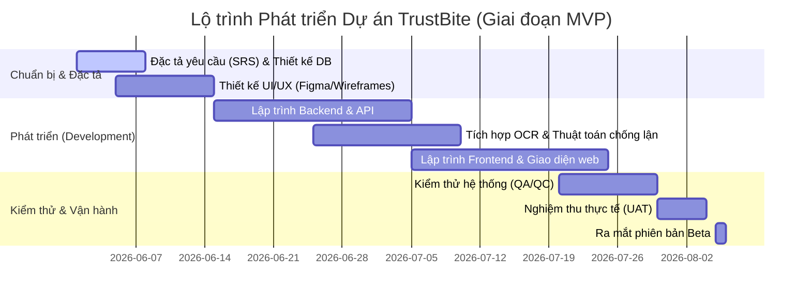

# 🏛️ PROJECT CHARTER (HIẾN CHƯƠNG DỰ ÁN)
## DỰ ÁN: PLATFORM ĐÁNH GIÁ ẨM THỰC TIN CẬY - TRUSTBITE

| Thông tin dự án | Chi tiết |
| :--- | :--- |
| **Tên dự án** | TrustBite (Đại diện cho: "Sự tin cậy trong từng miếng ăn") |
| **Phiên bản tài liệu** | v1.0.0 (Enterprise Standard) |
| **Ngày khởi tạo** | 01/06/2026 |
| **Người phê duyệt** | Ban Giám đốc Dự án (Project Sponsor) |

---

## 1. BỐI CẢNH & TẦM NHÌN DỰ ÁN (PROJECT CONTEXT & VISION)

### 1.1. Bối cảnh thị trường
Hiện nay, thị trường review ẩm thực đang bị thao túng mạnh mẽ bởi các chiến dịch seeding quảng cáo và các KOL/KOC nhận tiền để viết đánh giá tâng bốc chất lượng món ăn. Điều này dẫn tới sự suy giảm nghiêm trọng lòng tin của người tiêu dùng đối với các nền tảng review truyền thống. Người dùng có xu hướng tìm kiếm những đánh giá thực tế, không thiên vị nhưng thiếu một nền tảng xác thực uy tín để tin cậy.

### 1.2. Tầm nhìn chiến lược
**TrustBite** hướng tới trở thành nền tảng số 1 về đánh giá ẩm thực chân thực tại Việt Nam, nơi mỗi đánh giá đều được xác minh chặt chẽ thông qua dữ liệu số (hóa đơn thanh toán, tọa độ định vị thực tế). TrustBite nói **KHÔNG** với việc nhận tiền quảng cáo để thay đổi điểm số, đảm bảo tính khách quan tối đa cho người dùng.

---

## 2. MỤC TIÊU DỰ ÁN (PROJECT OBJECTIVES - OKRs)

*   **Objective 1 (Xây dựng lòng tin):** Đạt tỷ lệ >95% review trên hệ thống là review được xác minh thực tế (Verified Reviews) có kèm hóa đơn/GPS trong vòng 6 tháng đầu hoạt động.
*   **Objective 2 (Độ lớn cộng đồng):** Thu hút 50,000 người dùng hoạt động hàng tháng (MAU) và 5,000 quán ăn đăng ký tài khoản xác minh uy tín.
*   **Objective 3 (Độ tin cậy kỹ thuật):** Hệ thống OCR nhận diện hóa đơn chính xác >90% đối với các hóa đơn in từ các phần mềm POS phổ biến.

---

## 3. PHẠM VI DỰ ÁN (PROJECT SCOPE)

### 3.1. Phạm vi thực hiện (In-Scope)
*   Xây dựng hệ thống Web Application (Responsive chạy tốt trên cả Desktop và Mobile).
*   Phát triển **Động cơ chống gian lận (Anti-Fraud Engine)** bao gồm: quét OCR hóa đơn, đối chiếu tọa độ định vị GPS, thuật toán phát hiện seeding trùng lặp.
*   Thiết kế hệ thống **Game hóa (Gamification)** để thăng cấp bậc (Ranks) và tích lũy huy hiệu (Badges) dựa trên độ uy tín cá nhân.
*   Xây dựng 3 cổng giao diện chuyên biệt: Khách ăn (User App), Chủ quán (Merchant Portal), và Quản trị viên (Admin Portal).

### 3.2. Nằm ngoài phạm vi (Out-of-Scope trong Giai đoạn 1)
*   Ứng dụng di động Native App (iOS/Android) trên App Store và Google Play (sẽ triển khai ở Giai đoạn 2).
*   Hệ thống liên kết trực tiếp để đặt bàn hoặc thanh toán trực tuyến (Booking & Payment Gateway).

---

## 4. CƠ CẤU NHÂN SỰ & VAI TRÒ (ORGANIZATIONAL STRUCTURE)

*   **Product Owner (PO):** Định hướng sản phẩm, quản lý Product Backlog, làm việc trực tiếp với các bên liên quan.
*   **System Architect (SA):** Thiết kế kiến trúc hệ thống, sơ đồ cơ sở dữ liệu và đảm bảo khả năng mở rộng.
*   **Frontend & Backend Engineers:** Phát triển giao diện người dùng và logic xử lý dữ liệu backend (OCR, API, Bảo mật).
*   **QA/QC Team:** Thiết lập kế hoạch kiểm thử, viết testcase và thực hiện nghiệm thu sản phẩm (UAT).
*   **Admin Operations:** Đội ngũ vận hành, duyệt hồ sơ quán ăn và xử lý khiếu nại chất lượng review.

---

## 5. LỘ TRÌNH PHÁT TRIỂN CẤP CAO (HIGH-LEVEL MILESTONES)

