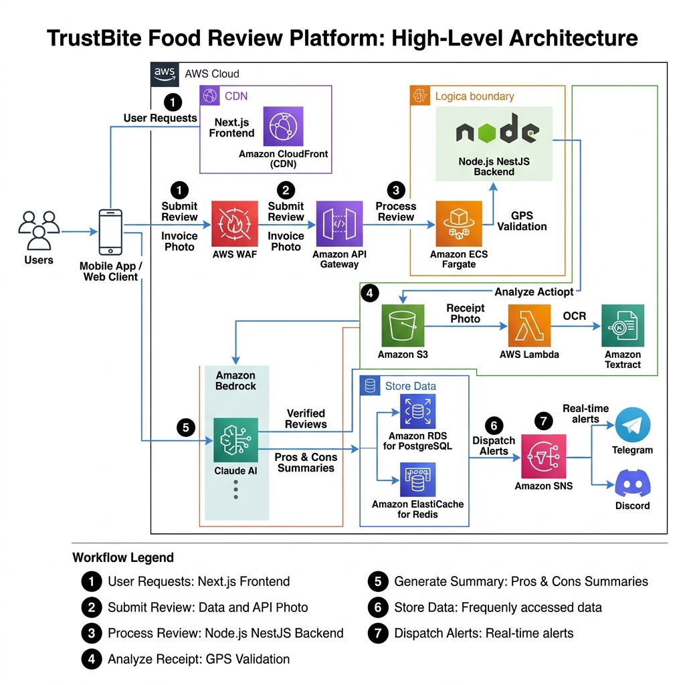

# AWS CLOUD INFRASTRUCTURE & ARCHITECTURE SPECIFICATION
## DỰ ÁN: PLATFORM ĐÁNH GIÁ ẨM THỰC TIN CẬY - TRUSTBITE

| Thông tin tài liệu | Chi tiết |
| :--- | :--- |
| **Loại tài liệu** | Cloud Infrastructure Specification (AWS Native) |
| **Phiên bản** | v1.0.0 (Enterprise Standard) |
| **Tác giả** | Lead Cloud Architect / Devops Engineer |
| **Trạng thái** | Đã phê duyệt (Approved) |

---

## 1. TỔNG QUAN KIẾN TRÚC CLOUD NATIVE AWS (ARCHITECTURAL OVERVIEW)

Để đảm bảo khả năng mở rộng (Scalability), tính sẵn sàng cao (High Availability), bảo mật tuyệt đối (Enterprise Security) và tối ưu hóa chi phí, toàn bộ hệ thống **TrustBite** được thiết kế để vận hành 100% trên hạ tầng điện toán đám mây **Amazon Web Services (AWS)**. 



### Quy trình xử lý luồng dữ liệu (Step-by-Step Data Flow):
1. **Yêu cầu giao diện (Client & Delivery):** Khách ăn hoặc chủ quán truy cập Next.js Frontend thông qua Amazon Route 53 và CloudFront CDN.
2. **Gửi dữ liệu đánh giá & hóa đơn:** Thiết bị khách hàng gửi dữ liệu review kèm ảnh chụp hóa đơn đi qua màng lọc bảo mật AWS WAF và API Gateway.
3. **Định vị & Kiểm tra tọa độ (Compute):** API Gateway chuyển request đến Backend Node.js (NestJS) chạy trên Amazon ECS Fargate để tính khoảng cách Haversine đối chiếu GPS.
4. **Lưu trữ & Kích hoạt OCR:** Ảnh hóa đơn được lưu vào S3 Receipts Bucket và gửi yêu cầu quét trích xuất thông tin chữ viết tự động đến Amazon Textract.
5. **Tổng hợp đánh giá AI:** Sau khi hóa đơn được xác thực hợp lệ, backend gửi toàn bộ review verified của quán đến Amazon Bedrock (Claude 3.5 Sonnet) để sinh tóm tắt Pros/Cons.
6. **Lưu trữ dữ liệu & Cập nhật điểm:** Review đã xác minh được lưu vào database chính Amazon RDS PostgreSQL (thông qua RDS Proxy để kiểm soát kết nối) và cập nhật cache Redis. Hệ thống tự động tính lại điểm Trust Score của quán.
7. **Thông báo đa kênh (Alerting):** Amazon SNS tiếp nhận sự kiện và gửi tin nhắn OTP xác thực hoặc bắn thông báo đẩy (Push Notifications) về chatroom Telegram/Discord/Slack.

Hệ thống áp dụng kiến trúc **Serverless & Containerization** kết hợp:

```mermaid
graph TD
    Client([Khách hàng / Web Browser]) -->|DNS| Route53[Amazon Route 53]
    Route53 -->|HTTPS| CloudFront[Amazon CloudFront CDN]
    CloudFront -->|Tải trang| S3Static[Amazon S3 Static Website]
    CloudFront -->|Gọi API| WAF[AWS WAF Firewall]
    WAF --> APIGateway[Amazon API Gateway]

    %% Compute Layer
    subgraph Compute Layer (Lập trình Serverless & Containers)
        APIGateway -->|Auth/User API| LambdaAuth[AWS Lambda - Python/NodeJS]
        APIGateway -->|Merchant/Game API| LambdaCore[AWS Lambda - Python/NodeJS]
        APIGateway -->|Review/Anti-Fraud API| ECS[Amazon ECS on AWS Fargate]
    end

    %% Storage & Database Layer
    subgraph Data & Storage Layer
        LambdaAuth --> Cognito[Amazon Cognito User Pool]
        LambdaAuth --> RDS[(Amazon RDS for PostgreSQL - Multi-AZ)]
        LambdaCore --> RDS
        ECS --> RDS
        ECS -->|Cache & OCR Queue| ElastiCache[(Amazon ElastiCache for Redis)]
        ECS -->|Lưu ảnh hóa đơn| S3Receipts[Amazon S3 Receipts Bucket]
    end

    %% AI & Notification Layer
    subgraph AI & Security Services
        ECS -->|Trích xuất OCR| Textract[Amazon Textract AI]
        Cognito -->|Gửi OTP SMS| SNS[Amazon SNS]
        RDS -.-> Secrets[AWS Secrets Manager]
    end

    %% Monitoring Layer
    subgraph DevOps & Observability
        Compute Layer -.-> CloudWatch[Amazon CloudWatch Logging]
        Compute Layer -.-> XRay[AWS X-Ray Tracing]
    end
```

---

## 2. BẢN ĐỒ DỊCH VỤ AWS ĐƯỢC SỬ DỤNG (AWS SERVICES MAPPING)

| Thành phần hệ thống | Dịch vụ AWS lựa chọn | Vai trò & Lý do kỹ thuật |
| :--- | :--- | :--- |
| **Giao diện tĩnh (Frontend)** | **Amazon S3 + CloudFront** | S3 lưu trữ toàn bộ code HTML/CSS/JS. CloudFront làm nhiệm vụ phân phối nội dung (CDN) tốc độ cao, tối ưu độ trễ cho người dùng tại Việt Nam và tích hợp chứng chỉ bảo mật SSL (ACM). |
| **Quản lý tên miền** | **Amazon Route 53** | Quản lý bản ghi DNS có độ trễ cực thấp, hỗ trợ tính năng chuyển đổi dự phòng (failover) tự động. |
| **Bảo mật mạng** | **AWS WAF (Web Application Firewall)** | Ngăn chặn các cuộc tấn công DDoS, SQL Injection, Cross-Site Scripting (XSS) và các bot seeding tự động. |
| **Quản lý API** | **Amazon API Gateway** | Quản lý định tuyến API, xử lý CORS, phân luồng giới hạn lượt gọi (Rate Limiting) để chống phá hoại hệ thống. |
| **Định danh người dùng** | **Amazon Cognito** | Quản lý đăng ký, đăng nhập tài khoản, mã hóa phiên hoạt động (JWT tokens). Liên kết với **Amazon SNS** để gửi SMS OTP xác thực số điện thoại. |
| **Backend nhẹ (Auth/Game)** | **AWS Lambda (Serverless)** | Chạy code xử lý đăng ký, tính điểm EXP, thăng cấp bậc. Tự động co giãn theo lượng truy cập, giúp tối ưu chi phí (chỉ trả tiền khi code chạy). |
| **Backend nặng (Anti-Fraud)** | **Amazon ECS on AWS Fargate** | Chạy các container chứa thuật toán đối chiếu GPS phức tạp, xử lý ảnh hóa đơn. Fargate giúp chạy container mà không cần quản lý hệ điều hành máy chủ ảo (EC2). |
| **Cơ sở dữ liệu chính** | **Amazon RDS for PostgreSQL** | Cơ sở dữ liệu quan hệ được quản lý hoàn toàn bởi AWS. Thiết lập tính năng **Multi-AZ** (Tự động sao lưu dữ liệu sang vùng dự phòng khác để đảm bảo dự án không bị gián đoạn nếu gặp sự cố phần cứng). |
| **Bộ nhớ đệm & Hàng đợi**| **Amazon ElastiCache for Redis** | Lưu trữ tạm các phiên đăng nhập (session), lưu cache danh sách quán ăn hot và tạo hàng đợi (Queue) xử lý OCR hóa đơn bất đồng bộ. |
| **Lưu trữ tệp tin** | **Amazon S3 (Receipts Bucket)** | Lưu trữ ảnh chụp hóa đơn của người dùng. Thiết lập **S3 Lifecycle Policy** để tự động nén và chuyển hóa đơn cũ hơn 6 tháng sang **S3 Glacier** nhằm tiết kiệm 80% chi phí lưu trữ. |
| **Nhận diện hóa đơn (OCR)**| **Amazon Textract** | Dịch vụ AI chuyên dụng của AWS để tự động đọc và trích xuất chữ viết, bảng biểu từ hóa đơn thanh toán với độ chính xác cực cao, thay thế hoàn toàn công nghệ bên thứ ba. |
| **Quản lý khóa bí mật** | **AWS Secrets Manager** | Lưu trữ an toàn các thông tin nhạy cảm như mật khẩu DB, khóa API mà không cần ghi trực tiếp (hardcode) vào mã nguồn. |

---

## 3. CHÍNH SÁCH BẢO MẬT & VẬN HÀNH (SECURITY & OPERATIONAL EXCELLENCE)

*   **Nguyên tắc đặc quyền tối thiểu (Least Privilege):** Tất cả các dịch vụ AWS tương tác với nhau đều được phân quyền chặt chẽ thông qua các vai trò **AWS IAM (Identity and Access Management)**. Ví dụ: Dịch vụ Lambda chỉ có quyền ghi vào bảng `users` chứ không có quyền xóa dữ liệu.
*   **Mạng ảo cô lập (Amazon VPC):** Cơ sở dữ liệu RDS và cụm container ECS được đặt hoàn toàn trong **Private Subnet** (Mạng nội bộ bảo mật), không thể truy cập trực tiếp từ Internet. Chỉ có duy nhất API Gateway mới có quyền gọi các dịch vụ này thông qua các VPC Endpoints.
*   **Giám sát thời gian thực:** Sử dụng **Amazon CloudWatch** kết hợp **AWS X-Ray** để theo dõi chi tiết hiệu năng của từng dòng code backend, tự động gửi cảnh báo (Alarms) về email hoặc Telegram của đội ngũ kỹ thuật nếu hệ thống gặp lỗi hoặc quá tải.

