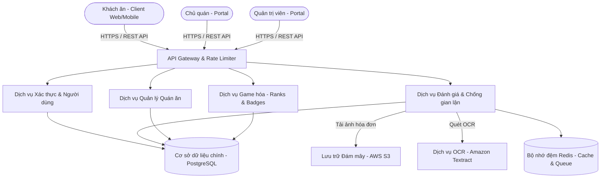

# 🏛️ SYSTEM ARCHITECTURE & DATABASE DESIGN
## DỰ ÁN: PLATFORM ĐÁNH GIÁ ẨM THỰC TIN CẬY - TRUSTBITE

| Thông tin tài liệu | Chi tiết |
| :--- | :--- |
| **Loại tài liệu** | System Architecture & Database Design |
| **Phiên bản** | v1.0.0 (Enterprise Standard) |
| **Tác giả** | System Architect (SA) |
| **Trạng thái** | Đã phê duyệt (Approved) |

---

## 1. KIẾN TRÚC HỆ THỐNG TỔNG QUAN (SYSTEM ARCHITECTURE OVERVIEW)

Hệ thống TrustBite được thiết kế theo mô hình **Client-Server kiến trúc Microservices** (hoặc Modular Monolith ở giai đoạn MVP để tối ưu tốc độ phát triển) nhằm đảm bảo hiệu năng và tính khả thi cao:

### Lựa chọn Công nghệ chính thức (Finalized Tech Stack):
*   **Frontend (UI Layer):** **Next.js v14+ (App Router)** chạy bằng **TypeScript** để tối ưu hóa SEO (SSR) và giao diện người dùng mượt mà.
*   **Backend (API Layer):** **Node.js (NestJS Framework)** viết bằng **TypeScript** để xây dựng kiến trúc API bền vững, chịu tải cao.
*   **Cơ sở dữ liệu chính:** **PostgreSQL (Amazon RDS)** đảm bảo tính toàn vẹn dữ liệu ACID tuyệt đối.
*   **Lưu trữ hình ảnh:** **Amazon S3** bảo mật cho ảnh hóa đơn thanh toán.
*   **Caching & Hàng đợi:** **Redis (Amazon ElastiCache)** làm bộ nhớ đệm và hàng đợi BullMQ xử lý OCR bất đồng bộ.

---

## 2. THIẾT KẾ CƠ SỞ DỮ LIỆU CHI TIẾT (DATABASE SCHEMA DESIGN)

Dưới đây là sơ đồ chi tiết các bảng trong cơ sở dữ liệu quan hệ PostgreSQL của dự án TrustBite:

### 2.1. Bảng `users` (Thông tin tài khoản người dùng)
Lưu trữ thông tin cá nhân, điểm số EXP và cấp bậc danh tiếng của khách ăn.

| Tên trường | Kiểu dữ liệu | Ràng buộc | Mô tả |
| :--- | :--- | :--- | :--- |
| `id` | SERIAL | PRIMARY KEY | ID định danh duy nhất của người dùng |
| `phone_number` | VARCHAR(15) | UNIQUE, NOT NULL | Số điện thoại đăng ký (dùng để OTP) |
| `password_hash` | VARCHAR(255) | NOT NULL | Mật khẩu đã được băm (bcrypt) |
| `full_name` | VARCHAR(100) | NOT NULL | Họ và tên hiển thị |
| `avatar_url` | VARCHAR(255) | | Link ảnh đại diện của người dùng |
| `total_exp` | INTEGER | DEFAULT 0 | Tổng điểm kinh nghiệm đạt được |
| `trust_score` | DECIMAL(3,2) | DEFAULT 5.00 | Điểm uy tín cá nhân (tính theo hành vi review) |
| `rank_level` | VARCHAR(20) | DEFAULT 'NEWBIE' | Cấp bậc hiện tại (NEWBIE, APPRENTICE, GOURMET, FOODGOD) |
| `created_at` | TIMESTAMP | DEFAULT CURRENT_TIMESTAMP| Thời gian tạo tài khoản |

### 2.2. Bảng `restaurants` (Thông tin quán ăn/nước uống)
Lưu trữ thông tin chi tiết về các cơ sở dịch vụ ăn uống đã được kiểm duyệt.

| Tên trường | Kiểu dữ liệu | Ràng buộc | Mô tả |
| :--- | :--- | :--- | :--- |
| `id` | SERIAL | PRIMARY KEY | ID định danh duy nhất của quán ăn |
| `name` | VARCHAR(150) | NOT NULL | Tên quán ăn |
| `address` | VARCHAR(255) | NOT NULL | Địa chỉ chi tiết |
| `latitude` | DECIMAL(10, 8)| NOT NULL | Vĩ độ (Dùng cho bản đồ và GPS) |
| `longitude` | DECIMAL(11, 8)| NOT NULL | Kinh độ (Dùng cho bản đồ và GPS) |
| `average_price`| DECIMAL(10, 2)| | Khoảng giá trung bình |
| `trust_score` | DECIMAL(3,2) | DEFAULT 0.00 | Điểm Chân Thật trung bình (tính từ các Verified Reviews) |
| `status` | VARCHAR(20) | DEFAULT 'PENDING' | Trạng thái phê duyệt (PENDING, APPROVED, REJECTED, SUSPENDED) |
| `created_at` | TIMESTAMP | DEFAULT CURRENT_TIMESTAMP| Thời gian quán đăng ký hệ thống |

### 2.3. Bảng `reviews` (Thông tin các bài đánh giá)
Bảng cốt lõi liên kết giữa người dùng và quán ăn, lưu vết bằng chứng chống gian lận.

| Tên trường | Kiểu dữ liệu | Ràng buộc | Mô tả |
| :--- | :--- | :--- | :--- |
| `id` | SERIAL | PRIMARY KEY | ID định danh duy nhất của review |
| `user_id` | INTEGER | FOREIGN KEY | ID người viết đánh giá (Liên kết bảng `users`) |
| `restaurant_id`| INTEGER | FOREIGN KEY | ID quán ăn được đánh giá (Liên kết bảng `restaurants`) |
| `rating_food` | INTEGER | CHECK (1-5) | Điểm đánh giá chất lượng món ăn |
| `rating_price`| INTEGER | CHECK (1-5) | Điểm đánh giá tính hợp lý của giá cả |
| `rating_service`| INTEGER | CHECK (1-5) | Điểm đánh giá thái độ phục vụ |
| `rating_space`| INTEGER | CHECK (1-5) | Điểm đánh giá không gian quán |
| `comment` | TEXT | NOT NULL | Nội dung đánh giá (tối thiểu 50 ký tự) |
| `receipt_url` | VARCHAR(255) | | Link ảnh chụp hóa đơn thanh toán (đã blur) |
| `receipt_hash`| VARCHAR(64) | UNIQUE | Mã băm SHA-256 của ảnh hóa đơn để chống trùng lặp |
| `gps_verified`| BOOLEAN | DEFAULT FALSE | Xác nhận người dùng có định vị khớp với quán |
| `review_status`| VARCHAR(20) | DEFAULT 'REFERENCE' | Phân loại review (VERIFIED, REFERENCE, FLAGGED_SPAM) |
| `created_at` | TIMESTAMP | DEFAULT CURRENT_TIMESTAMP| Thời gian đăng đánh giá |

### 2.4. Bảng `badges` và `user_badges` (Quản lý huy hiệu người dùng)
*   **Bảng `badges`:** Định nghĩa các loại huy hiệu trong hệ thống.
    *   `id` (PK), `name`, `description`, `icon_url`, `badge_type`.
*   **Bảng `user_badges`:** Mối quan hệ nhiều - nhiều giữa người dùng và huy hiệu họ đạt được.
    *   `user_id` (FK), `badge_id` (FK), `acquired_at` (Thời gian nhận).
