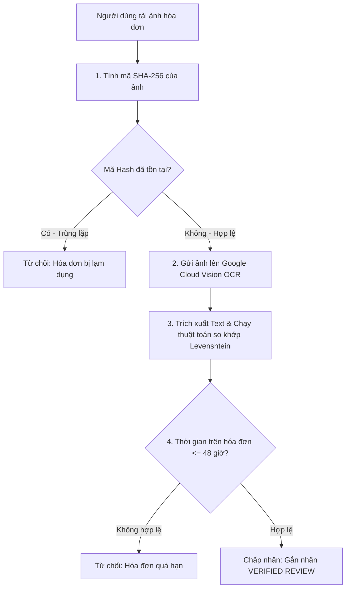

# 🛡️ ANTI-FRAUD SPECIFICATION & TRUST ALGORITHMS
## DỰ ÁN: PLATFORM ĐÁNH GIÁ ẨM THỰC TIN CẬY - TRUSTBITE

| Thông tin tài liệu | Chi tiết |
| :--- | :--- |
| **Loại tài liệu** | Anti-Fraud Specification & Trust Algorithms |
| **Phiên bản** | v1.0.0 (Enterprise Standard) |
| **Tác giả** | Lead Data Engineer / Security Architect |
| **Trạng thái** | Đã phê duyệt (Approved) |

---

## 1. THUẬT TOÁN XÁC THỰC VỊ TRÍ TRONG BÁN KÍNH (GPS BOUNDING BOX)

Để xác thực một bài đánh giá được viết bởi người dùng thực sự đã ghé thăm quán, hệ thống sử dụng **Công thức Haversine** để tính toán khoảng cách đường tròn lớn giữa tọa độ của người dùng gửi lên từ thiết bị di động ($Latitude_u$, $Longitude_u$) và tọa độ thực tế của quán ăn ($Latitude_r$, $Longitude_r$).

### Công thức toán học:
$$d = 2R \cdot \arcsin\left(\sqrt{\sin^2\left(\frac{\Delta\phi}{2}\right) + \cos(\phi_1)\cos(\phi_2)\sin^2\left(\frac{\Delta\lambda}{2}\right)}\right)$$

Trong đó:
*   $\phi_1, \phi_2$ lần lượt là Vĩ độ ($Latitude$) của người dùng và quán ăn ở đơn vị Radian.
*   $\Delta\phi$ là độ lệch Vĩ độ: $\phi_2 - \phi_1$.
*   $\Delta\lambda$ là độ lệch Kinh độ: $Longitude_r - Longitude_u$ ở đơn vị Radian.
*   $R$ là bán kính trung bình của Trái Đất ($6,371,000$ mét).
*   $d$ là khoảng cách thực tế giữa hai điểm (mét).

### Quy định nghiệp vụ:
*   **Ngưỡng hợp lệ ($d \le 200m$):** Hệ thống chấp nhận tọa độ GPS là hợp lệ, người dùng thực sự ở tại quán.
*   **Ngưỡng nghi ngờ ($d > 200m$):** Hệ thống từ chối xác thực GPS, bài review chuyển sang chế độ "Review Tham Khảo" thông thường.

---

## 2. QUY TRÌNH QUÉT OCR HÓA ĐƠN & KHỚP TỪ KHÓA (OCR SPECIFICATIONS)

Khi ảnh hóa đơn được tải lên, hệ thống thực hiện quy trình phân tích và đối chiếu qua 4 bước nghiêm ngặt:

### 2.1. Giải thuật so khớp Tên Quán (Levenshtein Distance)
Do hóa đơn in từ các máy POS khác nhau có thể hiển thị tên quán viết tắt hoặc không dấu (ví dụ: *"Pho Ngon 100"* thay vì *"Phở Ngon 100"*), hệ thống sử dụng thuật toán khoảng cách Levenshtein để đo độ tương đồng giữa chuỗi trích xuất được ($S_{ocr}$) và tên quán đã đăng ký trên hệ thống ($S_{db}$).

Độ tương đồng ($Similarity$) được tính bằng công thức:
$$Similarity(S_{ocr}, S_{db}) = \left(1 - \frac{LevenshteinDistance(S_{ocr}, S_{db})}{\max(|S_{ocr}|, |S_{db}|)}\right) \cdot 100\%$$

*   **Ngưỡng phê duyệt:** $Similarity \ge 80\%$.
*   Nếu kết quả nằm trong khoảng $60\% - 79\%$, hệ thống đẩy vào hàng đợi **Admin duyệt thủ công**. Dưới $60\%$, hóa đơn bị từ chối ngay lập tức.

---

## 3. CÔNG THỨC TÍNH ĐIỂM CHÂN THẬT CỦA QUÁN (REST-TRUST-SCORE)

Điểm hiển thị công khai của quán ăn trên TrustBite không phải là trung bình cộng đơn thuần của tất cả các sao, mà được tính toán dựa trên **Trọng số Điểm uy tín của người viết (User Trust Level)** để đảm bảo các tài khoản clone không thể kéo điểm của quán lên/xuống.

### Công thức tính điểm:
$$RestTrustScore = \frac{\sum_{i=1}^{n} (Rating_i \cdot W_i)}{\sum_{i=1}^{n} W_i}$$

Trong đó:
*   $Rating_i$: Điểm đánh giá trung bình 4 tiêu chí của review thứ $i$.
*   $W_i$: Trọng số tin cậy (Weight) của review thứ $i$.

### Bảng quy định Trọng số ($W_i$):

| Phân loại Review | Cấp bậc tài khoản (User Rank) | Trọng số ($W_i$) | Ý nghĩa |
| :--- | :--- | :---: | :--- |
| **Review Thường (Không hóa đơn)** | Bất kỳ cấp bậc nào | **0.1** | Đóng góp rất ít vào điểm tổng của quán để tránh spam. |
| **Verified Review (Có hóa đơn/GPS)**| Cấp 1: Người Mới | **0.5** | Tài khoản mới nhưng có bằng chứng hóa đơn. |
| **Verified Review (Có hóa đơn/GPS)**| Cấp 2: Thực Thần Tập Sự | **0.8** | Tài khoản đã hoạt động ổn định. |
| **Verified Review (Có hóa đơn/GPS)**| Cấp 3: Người Sành Ăn | **1.0** | Trọng số chuẩn của chuyên gia trung thực. |
| **Verified Review (Có hóa đơn/GPS)**| Cấp 4: Thần Ăn Đã Chứng | **1.5** | Đóng góp cực kỳ uy tín, có tầm ảnh hưởng lớn nhất. |
