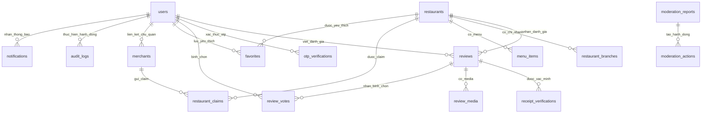

# Sơ đồ quan hệ thực thể - TrustBite

## ERD logic

## Ghi chú thiết kế chính

- `receipt_verifications` tách khỏi `reviews` để quản lý OCR/GPS/hash/rủi ro/quyết định quản trị độc lập.
- `moderation_reports` dùng `entity_type/entity_id` để có thể báo cáo đánh giá, quán hoặc nội dung của chủ quán nếu cần.
- `audit_logs` dùng entity generic để ghi mọi quyết định vận hành quan trọng.
- `device_fingerprints` là tín hiệu bảo mật tùy chọn và phải tuân thủ chính sách quyền riêng tư.
